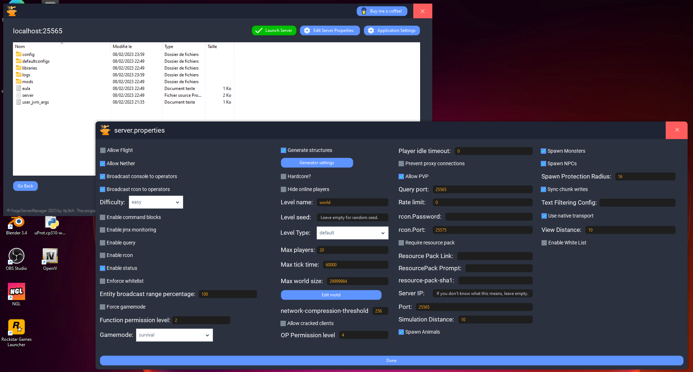

 

  

<h3 align="center">ForgeServerManager (FSM)</h3>

  

    This all-in-one tool makes local forge server making super easy :D
     
    This tool also work with vanilla servers.
     
     
    <strong>⚠️THIS PROJECT IS STILL IN ALPHA / DEVELOPEMENT⚠️</strong>
     
    <strong>⚠️YOU CAN, FOR NOW, ONLY CREATE 1.18.2 FORGE SERVERS⚠️</strong>
     
     
         
    <a href="https://github.com/Xp3rtA/ForgeServerManager/issues">Report Bug</a>
    ·
    <a href="https://github.com/Xp3rtA/ForgeServerManager/issues">Request Feature</a>
  

<!-- ABOUT THE PROJECT -->
## About The Project

FSM features a fully functionnal configuration / server maker tool.
 
It is fully made in vb.NET.

<!-- GETTING STARTED -->
## Getting Started

You are allowed to edit and fork this project and add your sauce to it! (for example, adding more versions support)

### Prerequisites

You <strong>need</strong> a GunaUI2 Winforms license to edit it.
You also need .NET Framework 4.7.2
Visual Studio 2022 is recommended, but you can use older versions.

### Installation

1. Clone or fork the project
2. Start the .sln
3. If you have everything right, the project will just start fine. Create a issue if not.

<!-- ROADMAP -->
## Roadmap

- [x] Create Server
- [ ] Multiple version support
- [x] Easy server properties edit
- [x] Launch server on the go

See the [open issues](https://github.com/Xp3rtA/ForgeServerManager/issues) for a full list of proposed features (and known issues).

<!-- CONTRIBUTING -->
## Contributing

Contributions are what make the open source community such an amazing place to learn, inspire, and create. Any contributions you make are **greatly appreciated**.

If you have a suggestion that would make this better, please fork the repo and create a pull request. You can also simply open an issue with the tag "enhancement".
Don't forget to give the project a star! Thanks again!

1. Fork the Project
2. Create your Feature Branch (`git checkout -b feature/AmazingFeature`)
3. Commit your Changes (`git commit -m 'Add some AmazingFeature'`)
4. Push to the Branch (`git push origin feature/AmazingFeature`)
5. Open a Pull Request

<!-- LICENSE -->
## License

You are authorized to modify the program and redistribute it, but **please give credits!**

<!-- CONTACT -->
## Contact

Twitter - [@KAMIKAZ_OFF_](https://twitter.com/KAMIKAZ_OFF_)

Project Link: [https://github.com/Xp3rtA/ForgeServerManager/](https://github.com/Xp3rtA/ForgeServerManager/)

(<a href="#readme-top">back to top</a>)

